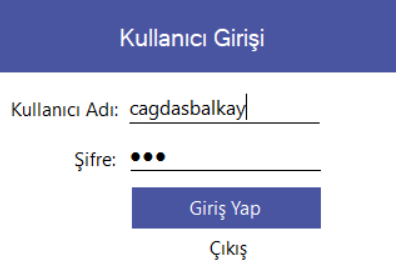
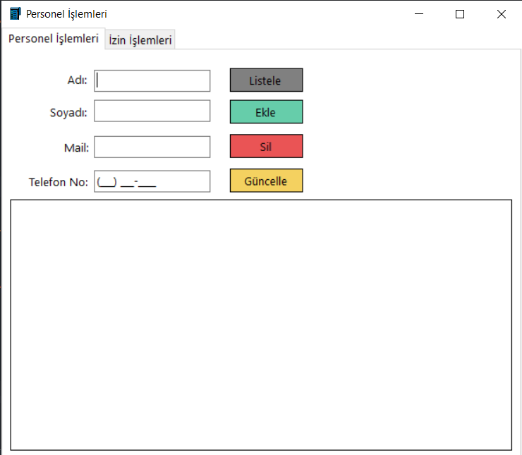
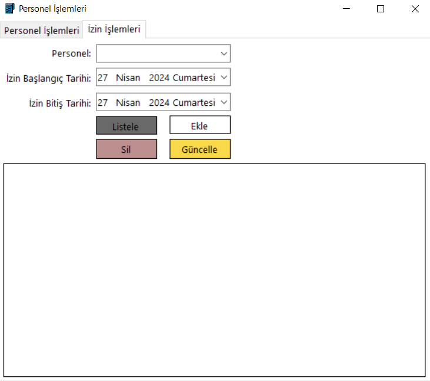
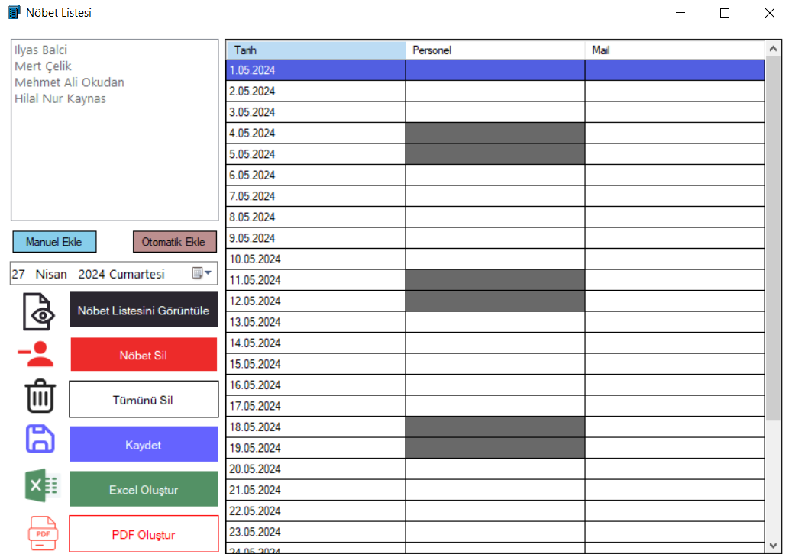

# Nöbet Listesi Uygulaması

## Genel Tanıtım
Nöbet listesi oluşturmak ve bunu çeşitli formatlara dönüştürme işlemini gerçekleştiren bir C# windows forms uygulamasıdır. Kodlar çeşitli gizlilik gerekliliği sebepleriyle paylaşılmamıştır fakat ekran görüntüleri ile uygulama tanıtılacaktır.

## Giriş Ekranı

 Bu ekran kullanıcı adı ve şifre doğrulamasından sonra uygulamaya giriş yapmamızı sağlayan kısımdır.Burada admin ve normal personel ayrımı bulunmaktadır. Normal personeller sadece nöbet listesi oluşturabilecek, admin ise tüm alanlara erişebilecektir.Aynı zamanda arkaplanda MD5 şifreleme algoritması ile şifreleme sağlanmıştır. 

## Geçiş Ekranı

 Bu ekrandan yetki seviyemize göre diğer ekranlara geçiş yapabiliriz. 

## Personel İşlemleri Ekranı

 Personel CRUD işlemlerini gerçekleştirebileceğimiz ekrandır. 

## İzin İşlemleri Ekranı

 Personellerin izin durumlarını düzenleyebileceğimiz ve görüntüleyebileceğimiz ekrandır. 

## Nöbet Listesi Ekranı

 Burası uygulamamızın asıl amacını barındıran ekrandır. Bu ekranda manuel ya da otomatik şekilde nöbet listesi oluşturabilir. Tarihe göre nöbet listelerini görüntüleyebilir.Nöbet listesini temizleyebilir ya da farklı formatlarda dışarı aktarabiliriz. 

